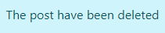

# MBA for CEO - Introduction

Project milestone 4 for Code Institute Full-stack development program.
This project is a Full Stack website built using the Django framework. MBA for CEO is a Master of Business Administration
courses for Chief Executive Officers advertising where users can look or search for a mba programms. When the user is logged in they can also 
like/unlike a post and comment on a post. They can also share their favourite MBA worldwide by adding a post 
on the add product or add course for student and upload or update their product image and details.

[Live Project Here](https://mbaforceo.herokuapp.com/)

        
        
## User Experience - UX
### User Stories

* As a website user, I can:

1. Navigate around the site and easily view the desired content.
2. View a list of MBA courses and choose accordingly.
3. Click on post to read the course details.
4. Register for an account to avail of the services offered to members.
5. View the number of likes on a mbaforceo thereby showing which is most popular.
6. View comments on mbaforceo so that I can read other users opinions.

* As logged in website user, I can:

1. Like/unlike MBA posts marking the course you enjoyed.
2. Comment on MBA for CEO and give my opinion about the posts.
3. Delete my previous comments.
4. Manage my posts by updating my details.
5. Edit my favourite MBA posted previously.
7. Delete my MBA for CEO posted previously.
8. Logout from the website.

* As a website superuser, I can:

1. Create and publish a new course.
2. Create draft course posts that can be reviewed and finalised later.
3. Create a new user, courses, author and categories.
4. Delete user, courses, author, categories and comments.
5. Approve user's comments.
6. Edit user's favourite MBA programm that was posted previously.
7. Delete user's favourite MBA courses that was posted previously.
8. Change the website permissions for a user.

### Agile Methodology

All functionality and development of this project were managed using GitHub which Projects can be found
[here](https://github.com/Zaurtime/mbaforceo/issues)

### The Scope

#### Main Site Goals

* To provide users with a good experience when using the MBA for CEO website.
* To provide users with a visually pleasing website that is intuitive to use and easy to navigate.
* To provide a website with a clear purpose.
* To provide role-based permissions that allows user to interact with the website.
* To provide tools that allow users to add products.

#### Imagery

* All the imagery is related to the MBA courses and website design.
The remaining imagery will be uploaded by the author to the database.

## Database Diagram

 

## Features

### Home Page

* The hero image welcomes the user with an advertising to create course for Student if our clients University or Business School and same time those interested customers can read posts what the website is about. 

### About Page

* The About Page gives, users information about the MBA for CEO website. It introduces the users to the
website. It also details the main purpose and the goal of the MBA for leaders worldwide. 

### Home Page

* On the Home Page, users have access to the MBA posts available on the website.
The user can choose to see the MBA course detail by clicking on the post card. 

### Post Detail Page - Top

* At the top of the Post Details Page, users can see the post's main
image and they can also have access to information about the post. The
post information includes MBA name,author name, posted date and the
option to like/unlike the post. It will also show how many likes and
comments the post has received. 

### Post Detail Page - Steps

* In this page section, users can read the MBA for CEO main post. 
* On this page, users are allowed to comment, delete and update their own post . The website superuser can delete or update any comments on the blog without having to access the admin panel.

### Post Detail Page - Comments

* At the bottom of this page right side, users can leave comments and left side read the comments posted by other users. If the user is logged in or is a 
superuser they have access to the buttons for deleting or updating comments.

### Add product Page

* On this page, registered users can fill out the form to add or edit a post with their favourite MBA programm and main creator will be famous universities marketing team.

### Signup Page

* On the Signup Page, a new user can sign up for the MBA for CEO website by filling out and then submitting the form.

### Login Page

* On the Login Page, users can log in to the website by inputting the username and password and have access 
  to website services for a user registered.

### Logout Page

* On the Logout Page, users can confirm that they wish to exit the website.

### Like Post

* When users are logged in to the website they can like a post  

### Unlike Post

* When users are logged in to the website they can unlike a post that has been liked by the user. 

### Leave Comment 

* When users are logged in to the website they can comment on a post. 

### Comment Post

* When users are logged in to the website they can comment on a post and after they submit the comment they will see a 
  message at the top of the page saying "Your comment is awaiting approval". 

### Add MBA course

  

* When users are logged in to the website they can publish a post with a favourite MBA program and after they submit the 
post they will see a message at the top of the page saying "Your post have been created". 

### Update Post

  
* When users are logged in to the website they can edit their own previously published posts and they will see the message 
  "The post have been updated" after pressing the Submit button. 

### Delete Post 1 

When users are logged in to the website and they wish to delete their posts, they can press the button Delete and a 
Bootstrap box model will pop up with the message Delete Course Post "Are you sure you want to delete this post?".   

### Delete Post 2 2

  

* After pressing the Delete button again inside the Bootstrap box model they will see a message on the 
  top of the page, "The Post have been deleted". 

### Logo

* When users click on logo they will redirect to home page  

### Footer

* When users are at the bottom of the page they can see footer 

## Admin Panel/Superuser

* On the Admin Panel, as an admin/superuser I have full access to CRUD functionality so I can view, create, edit and
delete the following ones:
1. Posts
2. Comments
3. Author
5. Likes

*As admin/superuser I can also approve comments, approve posts and change the status and give other permissions to the users. 

## Testing

### W3C HTML Validator results

* Checking completed.No Error Found or warnings to show  

### W3C CSS Validator results

* Checking completed.No Error Found  

### PEP8 tests

* All clear.No Error Found  

* All clear.No Error Found  

* All clear.No Error Found.Only minor warnings line too long  

* All clear.No Error Found  

* All clear.No Error Found  

* All clear.No Error Found  

### Lighthouse results

* Better than good overall Performance 97 

* Better than good  

## Technologies Used

### Languages Used

* [HTML 5](https://en.wikipedia.org/wiki/HTML/)
* [CSS 3](https://en.wikipedia.org/wiki/CSS)
* [JavaScript](https://www.javascript.com/)
* [Django](https://www.python.org/)
* [Python](https://www.djangoproject.com/)

#### Django Packages

* [Gunicorn](https://gunicorn.org/) 
   As the server for Heroku
* [Cloudinary](https://cloudinary.com/) 
   Was used to host the static files and media
* [Dj_database_url](https://pypi.org/project/dj-database-url/) 
   To parse the database URL from the environment variables in Heroku
* [Psycopg2](https://pypi.org/project/psycopg2/) 
   As an adaptor for Python and PostgreSQL databases
* [Summernote](https://summernote.org/) 
   As a text editor
* [Allauth](https://django-allauth.readthedocs.io/en/latest/installation.html) 
   For authentication, registration, account
   management
* [Crispy Forms](https://django-crispy-forms.readthedocs.io/en/latest/) 
   To style the forms

### Frameworks - Libraries - Programs Used

* [Bootstrap5](https://getbootstrap.com/) 
   Was used to style the website, add responsiveness and interactivity
* [Jquery](https://jquery.com/) 
   All the scripts were written using jquery library
* [Git](https://git-scm.com/) 
   Git was used for version control by utilizing the Gitpod terminal to commit to Git and push to GitHub
* [GitHub](https://github.com/) 
   GitHub is used to store the project's code after being pushed from Git
* [Heroku](https://id.heroku.com) 
   Heroku was used to deploy the live project
* [PostgreSQL](https://www.postgresql.org/) 
   Database used through heroku.
* [Lucidchart](https://lucid.app/) 
   Lucidchart was used to create the database diagram
* [PEP8](http://pep8online.com/) 
   PEP8 was used to validate all the Python code
* [W3C - HTML](https://validator.w3.org/) 
   W3C- HTML was used to validate all the HTML code
* [W3C - CSS](https://jigsaw.w3.org/css-validator/) 
   W3C - CSS was used to validate the CSS code
* [Fontawesome](https://fontawesome.com/) 
   To add icons to the website
* [Google Chrome Dev Tools](https://developer.chrome.com/docs/devtools/) 
   To check App responsiveness and debugging
* [Coolors](https://coolors.co/) 
   To build the colour palette of the project
   
## Creating the Django app

1. Go to the Code Institute Gitpod Full Template [Template](https://github.com/Code-Institute-Org/gitpod-full-template)
2. Click on Use This Template
3. Once the template is available in your repository click on Gitpod
4. When the image for the template and the Gitpod are ready open a new terminal to start a new Django App
5. Install Django and gunicorn: `pip3 install django gunicorn`
6. Install supporting database libraries dj_database_url and psycopg2 library: `pip3 install dj_database_url psycopg2`
7. Create file for requirements: in the terminal window type `pip freeze --local > requirements.txt`
8. Create project: in the terminal window type django-admin startproject your_project_name
9. Create app: in the terminal window type python3 manage.py startapp your_app_name
10. Add app to the list of installed apps in settings.py file: you_app_name
11. Migrate changes: in the terminal window type python3 manage.py migrate
12. Run the server to test if the app is installed, in the terminal window type python3 manage.py runserver
13. If the app has been installed correctly the window will display The install worked successfully! Congratulations!

## Deployment of This Project

* This site was deployed by completing the following steps:

1. Log in to [Heroku](https://id.heroku.com) or create an account
2. On the main page click the button labelled New in the top right corner and from the drop-down menu select Create New
App
3. You must enter a unique app name
4. Next select your region
5. Click on the Create App button
6. Click in resources and select Heroku Postgres database
7. Click Reveal Config Vars and add a new record with SECRET_KEY
8. Click Reveal Config Vars and add a new record with the `CLOUDINARY_URL`
9. Click Reveal Config Vars and add a new record with the `DISABLE_COLLECTSTATIC = 1`
10. The next page is the project’s Deploy Tab. Click on the Settings Tab and scroll down to Config Vars
11. Next, scroll down to the Buildpack section click Add Buildpack select python and click Save Changes
12. Scroll to the top of the page and choose the Deploy tab
13. Select Github as the deployment method
14. Confirm you want to connect to GitHub
15. Search for the repository name and click the connect button
16. Scroll to the bottom of the deploy page and select the preferred deployment type
17. Click either Enable Automatic Deploys for automatic deployment when you push updates to Github

## Final Deployment 

1. Create a runtime.txt `python-3.8.13`
2. Create a Procfile `web: gunicorn your_project_name.wsgi`
3. When development is complete change the debug setting to: `DEBUG = False` in settings.py
4. In this project the summernote editor was used so for this to work in Heroku add: `X_FRAME_OPTIONS = SAMEORIGIN `to
   settings.py.
5. In Heroku settings, delete the config vars for `DISABLE_COLLECTSTATIC = 1`

## Forking This Project

* Fork this project by following the steps:

1. Open [GitHub](https://github.com/Zaurtime/mbaforceo)
2. Find the 'Fork' button at the top right of the page
3. Once you click the button the fork will be in your repository

## Cloning This Project

* Clone this project by following the steps:

1. Open [GitHub](https://github.com/Zaurtime/mbaforceo)
2. You will be provided with three options to choose from, HTTPS, SSH or GitHub CLI, click the clipboard icon in order
to copy the URL
3. Once you click the button the fork will be in your repository
4. Open a new terminal
5. Change the current working directory to the location that you want the cloned directory
6. Type 'git clone' and paste the URL copied in step 3
7. Press 'Enter' and the project is cloned

## Credits

### Content

* The images were taken from  [Shutterstock](https://www.shutterstock.com/photos)
* All MBA posts photos [Unsplash](https://unsplash.com/)
* The CEO|MBA logos and favicon are my own design and build

### Information Sources / Resources

* [Code Institute](https://learn.codeinstitute.net/ci_program/diplomainsoftwaredevelopmentecomm)
* [W3Schools - Python](https://www.w3schools.com/python/)
* [Stack Overflow](https://stackoverflow.com/)
* [Scrimba - Pyhton](https://scrimba.com/learn/python)

## Special Thanks

* Special thanks to my mentor Mr.Gareth, my classmates at Code Institute,my teachers in Code Institute for 
their effort and our student support team for assistance throughout this project you are Amazing.

